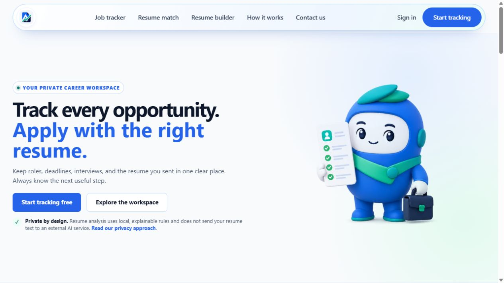
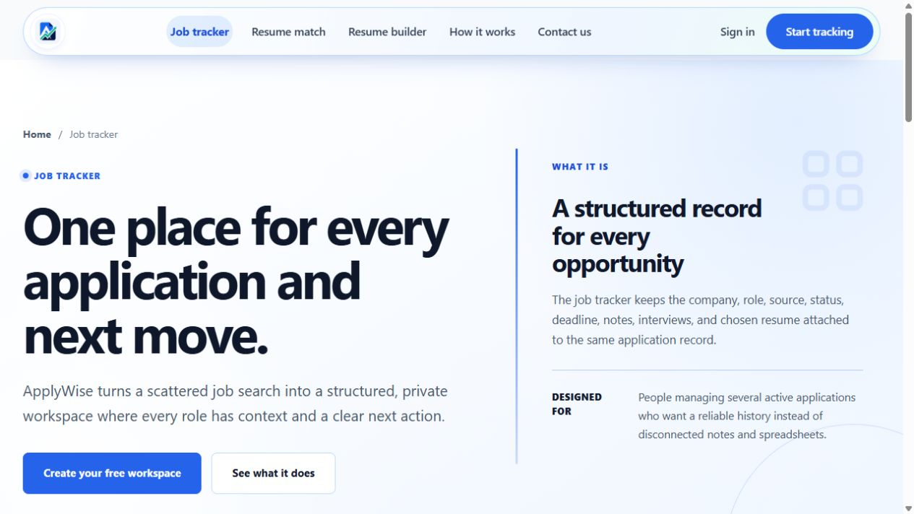
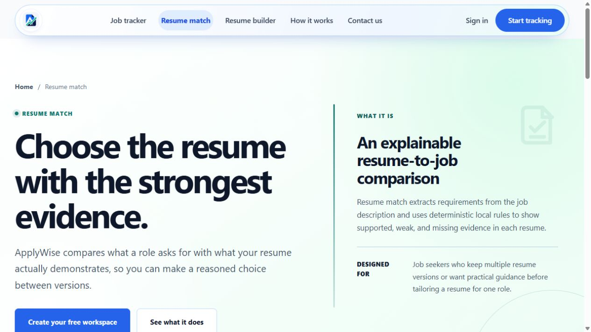
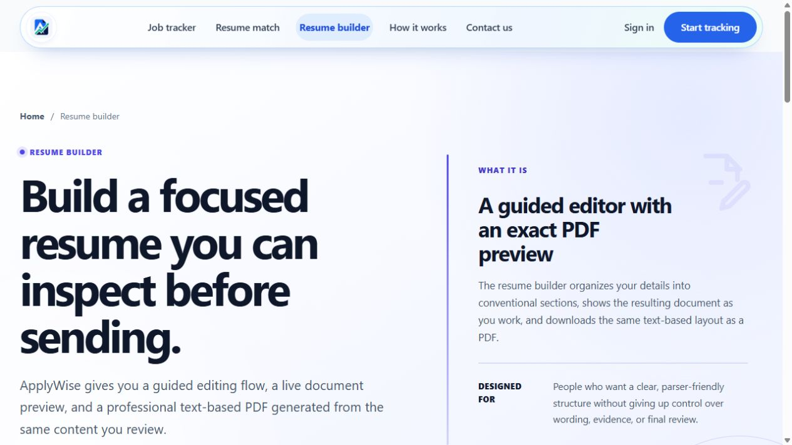

# ApplyWise

**Track every opportunity. Apply with the right resume.**

[](https://github.com/awaisbegin014/ApplyWise/actions/workflows/ci.yml)
[](https://github.com/awaisbegin014/ApplyWise/actions/workflows/monitor-production.yml)
[](https://dotnet.microsoft.com/)
[](https://applywise.runasp.net/)

ApplyWise is a privacy-focused job-search workspace built with ASP.NET Core MVC. It connects application tracking, resume version management, explainable resume matching, analytics, and a browser-based resume builder in one private account.

## Live product

- **Application:** [https://applywise.runasp.net](https://applywise.runasp.net/)
- **Status:** deployed public beta
- **Health:** [`/health/live`](https://applywise.runasp.net/health/live), [`/health/ready`](https://applywise.runasp.net/health/ready), and [`/health/release`](https://applywise.runasp.net/health/release)

The current deployment uses a resource-limited free hosting tier. It is suitable for a controlled beta, not a high-traffic public launch.



## What ApplyWise does

Most job searches become fragmented across job boards, email, spreadsheets, calendar notes, and several resume files. ApplyWise keeps the operational history together:

1. Save a role with its source, status, deadline, notes, and next action.
2. Upload or build multiple resume versions.
3. Compare resume evidence with the job description using deterministic local rules.
4. Record the resume actually submitted for each application.
5. Track application outcomes, follow-ups, deadlines, and source patterns.

Resume matching is intentionally explainable. This release does **not** send resume text to an external generative-AI service, and its estimates never claim to reproduce an employer's ATS or guarantee an interview.

## Product tour

### Job tracker

Keep every company, role, status, deadline, interview, note, and submitted resume attached to one application record.



### Resume match

Compare a job description with saved resumes and inspect supported, weak, and missing evidence before choosing a version.



### Resume builder

Create a focused resume with guided sections, local draft saving, a live A4 preview, and selectable-text PDF export.



## Core capabilities

- ASP.NET Core Identity registration, email confirmation, recovery, login, logout, MFA, and account management
- Optional Google sign-in with explicit linking for existing accounts
- Optional read-only Gmail import flow with a separate fail-closed production switch
- Private PDF resume library with version names, notes, default selection, ownership checks, and download authorization
- Browser-local resume builder with autosave, section reordering, formatting controls, A4 fit checks, and text-based PDF generation
- Application tracking with status, source, deadline, job link, notes, custom fields, and submitted-resume history
- Explainable readiness, job-match, and best-resume comparisons with evidence and analysis history
- Application outcome tracking, deadlines, and dashboard next actions
- Funnel, resume-performance, platform-response, and recurring skill-gap analytics
- Rule-based job-post quality and scam-risk reviews with private saved history
- Admin monitoring, user reports, contact-message management, release health, and production diagnostics
- Tenant-scoped authorization and resource quotas across product modules

## Technology

| Layer | Technology |
|---|---|
| Web | .NET 10, ASP.NET Core MVC, Razor Views |
| UI | Bootstrap 5, custom CSS design system, vanilla JavaScript |
| Authentication | ASP.NET Core Identity, optional Google OAuth |
| Data | Entity Framework Core 10, SQL Server / LocalDB |
| Resume parsing | PdfPig plus bounded PDF and DOCX inspection workers |
| PDF creation | pdfmake 0.3.11 with embedded local fonts |
| Protection | Data Protection certificates, antiforgery, rate limits, Turnstile, security headers |
| Delivery | GitHub Actions, immutable release artifacts, protected deployment, rollback evidence |
| Hosting | MonsterASP.NET and Monster MSSQL |

## Architecture

```text
Browser / Razor UI
        |
ASP.NET Core MVC controllers
        |
Application services
  |-- dashboard projections
  |-- application workflows
  |-- resume storage and bounded extraction
  |-- deterministic resume analysis
  |-- Gmail import review pipeline
        |
Entity Framework Core + SQL Server

Private filesystem
  |-- uploaded resumes
  |-- Data Protection keys
  `-- encryption certificate
```

Public files are served from `wwwroot`. Uploaded resumes, Data Protection keys, and encryption certificates are required to live outside the deployed web directory in production.

## Repository layout

```text
src/ApplyWise.Web/             ASP.NET Core MVC application
tests/ApplyWise.Web.Tests/     application, security, release, and UI contract tests
tests/resume-builder/          browser-side resume builder tests
tools/                         font and taxonomy tooling
docs/                          architecture, ATS, operations, and deployment documentation
.github/workflows/             validation, protected deployment, and production monitoring
```

## Run locally

### Prerequisites

- .NET 10 SDK matching [`global.json`](global.json)
- SQL Server LocalDB, Express, Developer, or another SQL Server instance
- Optional: EF Core CLI

```powershell
dotnet tool install --global dotnet-ef
```

### Setup

```powershell
git clone https://github.com/awaisbegin014/ApplyWise.git
cd ApplyWise
dotnet restore
dotnet ef database update --project src/ApplyWise.Web
dotnet run --project src/ApplyWise.Web
```

Open the HTTPS address printed by ASP.NET Core and create an account. No shared demo password or production data is included.

LocalDB is the development default. To use another SQL Server without editing tracked files:

```powershell
dotnet user-secrets set "ConnectionStrings:DefaultConnection" "<connection-string>" --project src/ApplyWise.Web
```

## Configuration

Production values must come from environment variables or a host secret store. Never commit real credentials.

| Configuration | Environment variable | Purpose |
|---|---|---|
| `ConnectionStrings:DefaultConnection` | `ConnectionStrings__DefaultConnection` | SQL Server connection |
| `PublicOrigin` | `PublicOrigin` | Canonical public HTTPS origin |
| `AllowedHosts` | `AllowedHosts` | Exact permitted public hosts |
| `ForwardedHeaders:KnownProxies` | `ForwardedHeaders__KnownProxies__0` | Trusted TLS proxy addresses |
| `HumanChallenge:*` | `HumanChallenge__Enabled`, `HumanChallenge__SiteKey`, `HumanChallenge__SecretKey`, `HumanChallenge__ExpectedHostname` | Turnstile protection |
| `Email:*` | `Email__Host`, `Email__Port`, `Email__UserName`, `Email__Password`, `Email__From` | Confirmation and recovery email |
| `Google:*` | `Google__ClientId`, `Google__ClientSecret` | Optional Google sign-in |
| `Google:Gmail*` | `Google__GmailImportEnabled`, `Google__GmailAutoSyncEnabled` and bounded sync settings | Optional Gmail import controls |
| `ResumeStorage:RootPath` | `ResumeStorage__RootPath` | Private resume directory |
| `DataProtection:*` | `DataProtection__KeysPath`, certificate path/password, previous certificates | Persistent encryption material |
| `Performance:SlowRequestThresholdMs` | `Performance__SlowRequestThresholdMs` | Slow-request warning threshold |

Google sign-in uses `/signin-google`. Gmail linking is a separate consent flow at `/signin-google-gmail` and requests `gmail.readonly`. Production enables Gmail import and scheduled sync through the protected deployment overlay; deployment approval must be withheld until the required Google verification is complete.

## Database migrations

Apply committed migrations:

```powershell
dotnet ef database update --project src/ApplyWise.Web
```

Create a new migration:

```powershell
dotnet ef migrations add <MigrationName> --project src/ApplyWise.Web
dotnet ef database update --project src/ApplyWise.Web
```

Production migrations are reviewed and applied against a recoverable backup before the corresponding immutable release artifact is deployed.

## Testing

Run the application test suite:

```powershell
dotnet test ApplyWise.sln --configuration Release
```

Run browser-side resume-builder tests:

```powershell
node --test tests/resume-builder/resume-builder.test.cjs
```

CI validates restore lock files, compilation, automated tests, security/release contracts, migrations, and deployable artifacts. The production workflow accepts only previously validated release and rollback runs, requires a protected environment approval, records deployment evidence, and verifies release identity plus readiness.

## Security and privacy

- Every product controller requires authentication and tenant-owned queries use the current Identity user ID.
- Resume/application relationships are revalidated before persistence.
- State-changing requests use antiforgery protection and constrained view models.
- Resume uploads are limited by extension, MIME type, signature, size, quota, parser concurrency, page count, and extracted-text bounds.
- Uploaded files use generated storage names and are never exposed as static web files.
- Production requires exact hosts, HTTPS origin, trusted proxies, secure SMTP, persistent Data Protection, and human verification.
- Baseline headers restrict framing, MIME sniffing, embedded objects, referrers, and unused browser permissions.
- Public registration, authentication, analysis, uploads, contact, Gmail sync, and health routes use bounded rate limits.

See [SECURITY.md](SECURITY.md) for vulnerability reporting and the supported security policy.

## Deployment and operations

- [Deployment guide](docs/DEPLOYMENT.md)
- [MonsterASP deployment checklist](DEPLOYMENT.md)
- [Operations, backup, restore, monitoring, and certificate rotation](docs/OPERATIONS.md)
- [ATS analysis model and evaluation](docs/ats-analysis.md)
- [Skill taxonomy import and provenance](docs/ats-taxonomy.md)

The three GitHub workflows provide distinct responsibilities:

- `ci.yml` builds, tests, and produces immutable release artifacts.
- `deploy-monster.yml` validates provenance, deploys with protected approval, verifies readiness, and supports automatic binary rollback.
- `monitor-production.yml` checks the public production endpoints and tracks unhealthy incidents.

## Current release status

ApplyWise is live and suitable for a controlled public beta. The application, database, schema, private storage, Data Protection, owner/MFA checks, contact page, and release fingerprint are covered by production health checks.

Before a broad launch, move from the current free hosting tier to resources sized from staging load-test results and add centralized logs, alert delivery, managed private object storage, and malware scanning.

## Roadmap

- Calendar integration for application deadlines
- Managed private object storage and upload malware scanning
- Formal retention, account export, and expanded deletion workflows
- Staging load tests and capacity-based hosting upgrades
- Centralized structured logs, traces, dashboards, and alerts
- Optional consent-based AI assistance with redaction, cost controls, and auditable prompts

---

Built as a full-stack product case study in ASP.NET Core, secure file handling, explainable matching, relational workflows, responsive UX, and production delivery.
